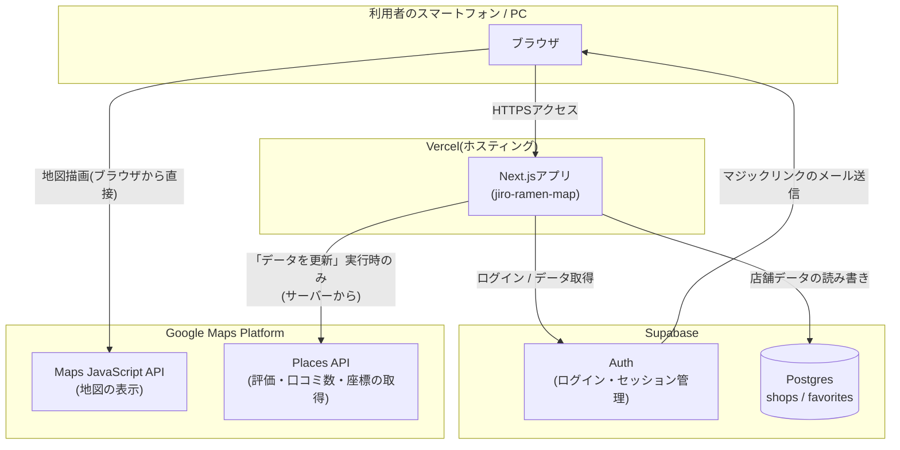
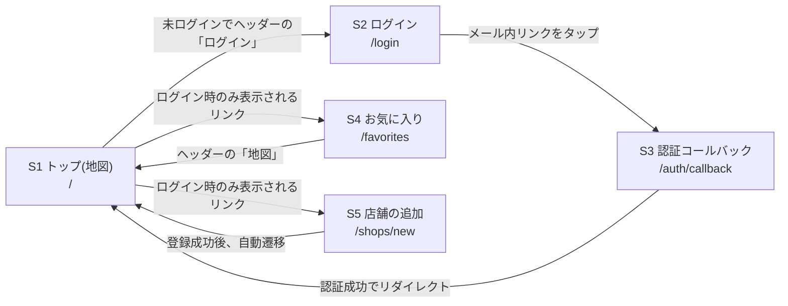
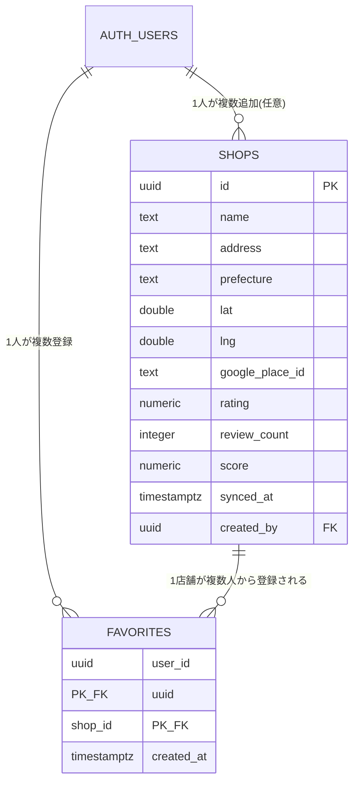

# 基本設計書

要件定義書([01_requirements.md](./01_requirements.md))で定めた要件を、どのような構成で実現するかを定義する。

## 1. システム構成

### 1.1 全体構成図

### 1.2 採用technology stack

| 分類 | 採用技術 | 採用理由 |
|---|---|---|
| フロントエンド/バックエンド | Next.js(App Router) + TypeScript | 画面(フロント)とサーバー処理(バックエンド)を1つのプロジェクトで書けるため、構成をシンプルにできる |
| ホスティング | Vercel | GitHubと連携し、pushするだけで自動デプロイされる。個人利用は無料 |
| データベース・認証 | Supabase(PostgreSQL) | データベースと、パスワード不要のログイン機能(マジックリンク)を同時に用意できる。個人利用は無料 |
| 地図・店舗情報 | Google Maps Platform(Maps JavaScript API, Places API) | 実在店舗の地図表示・評価・口コミ数の取得に必要。個人利用は基本無料枠内 |

### 1.3 なぜこの構成にしたか

- **「二郎系」という検索カテゴリがGoogleに存在しない**ため、店舗リストは自前のデータベース(Supabase)で保持し、
  評価・口コミ数・座標といった「変動する情報」だけをGoogle Places APIから都度取得する、というハイブリッド構成にした
- Google Places APIの呼び出しは**課金対象**なため、ページを開くたびに自動で呼び出すのではなく、
  ログインユーザーが「データを更新」ボタンを押した時だけサーバー側から呼び出す設計とし、コストを抑えている
- 地図の表示(Maps JavaScript API)自体はブラウザから直接Googleへアクセスする(課金は発生するが無料枠内で収まる想定)

## 2. 画面設計

### 2.1 画面一覧

| # | 画面名 | パス | ログイン要否 | 概要 |
|---|---|---|---|---|
| S1 | トップ(地図) | `/` | 不要(一部機能はログイン時のみ表示) | 地図と、おすすめ順の店舗一覧を表示 |
| S2 | ログイン | `/login` | - | メールアドレスを入力し、ログイン用リンクを送信する |
| S3 | 認証コールバック | `/auth/callback` | - | メール内リンクの飛び先。画面は持たず、ログイン処理後にトップへリダイレクトする |
| S4 | お気に入り | `/favorites` | 必要 | 自分がお気に入り登録した店舗の一覧 |
| S5 | 店舗の追加 | `/shops/new` | 必要 | 店名・住所を入力して新しい店舗を登録するフォーム |

### 2.2 画面遷移図

### 2.3 未ログイン時にできること / できないこと

| 操作 | 未ログイン | ログイン済み |
|---|---|---|
| 地図・店舗一覧の閲覧 | 可能 | 可能 |
| お気に入りの星マーク表示・操作 | 非表示 | 可能 |
| 「データを更新」ボタン | 非表示 | 可能 |
| 店舗の追加 | `/shops/new` にアクセスすると `/login` へ強制的に移動 | 可能 |
| お気に入り一覧 | `/favorites` にアクセスすると `/login` へ強制的に移動 | 可能 |

## 3. データベース設計(概要)

詳細なカラム定義は [03_detailed-design.md](./03_detailed-design.md) を参照。ここでは全体像のみを示す。

- `AUTH_USERS` は `auth.users` を表す(Supabaseが自動的に用意するログインユーザーのテーブルであり、本アプリ側では作成しない)
- `shops.created_by` は「誰が追加したか」の記録用であり、削除されても店舗データ自体は残る(`on delete set null`)

## 4. 外部インターフェース

| 連携先 | 用途 | 認証方法 |
|---|---|---|
| Supabase Auth | メールでのログイン(マジックリンク)、セッション管理 | Supabaseプロジェクトの anon key / service role key |
| Supabase Database | 店舗データ・お気に入りデータの読み書き | 上記と同じ。行レベルセキュリティ(RLS)でアクセス制御 |
| Google Maps JavaScript API | ブラウザ上での地図描画・マーカー表示 | APIキー(ブラウザに公開される。HTTPリファラー制限で保護) |
| Google Places API | 店舗の評価・口コミ数・座標の取得(Text Search → Place Details) | APIキー(サーバー側からのみ呼び出す) |

## 5. 非機能設計

### 5.1 セキュリティ設計

- **service role key(管理者鍵)はサーバー専用**とし、`NEXT_PUBLIC_` を付けない環境変数名で管理する
  (Next.jsは `NEXT_PUBLIC_` が付いた環境変数のみブラウザに公開するため、付けなければブラウザからは触れない)
- データベースへのアクセスはRLS(行レベルセキュリティ)で制御し、アプリのコード側の実装ミスがあっても
  「他人のお気に入りを削除できる」といった事故が起きないようにする
- ログイン処理(セッションの維持)は、Next.jsのミドルウェア(`middleware.ts`)で
  リクエストのたびにセッションを更新する構成とする(Supabase公式推奨のパターン)

### 5.2 コスト管理設計

- Google Places APIの呼び出しは、ユーザーが明示的に「データを更新」を押した時のみ実行し、
  ページ表示のたびには呼び出さない
- 詳細な料金試算・予算アラートの設定方法は [04_environment-setup.md](./04_environment-setup.md) を参照

### 5.3 おすすめスコアの設計方針

- 口コミ数が少ない店舗の評価が過大に扱われないよう、**ベイズ平均(加重平均)** による算出とする
- 計算式・パラメータの詳細は詳細設計書に記載する
