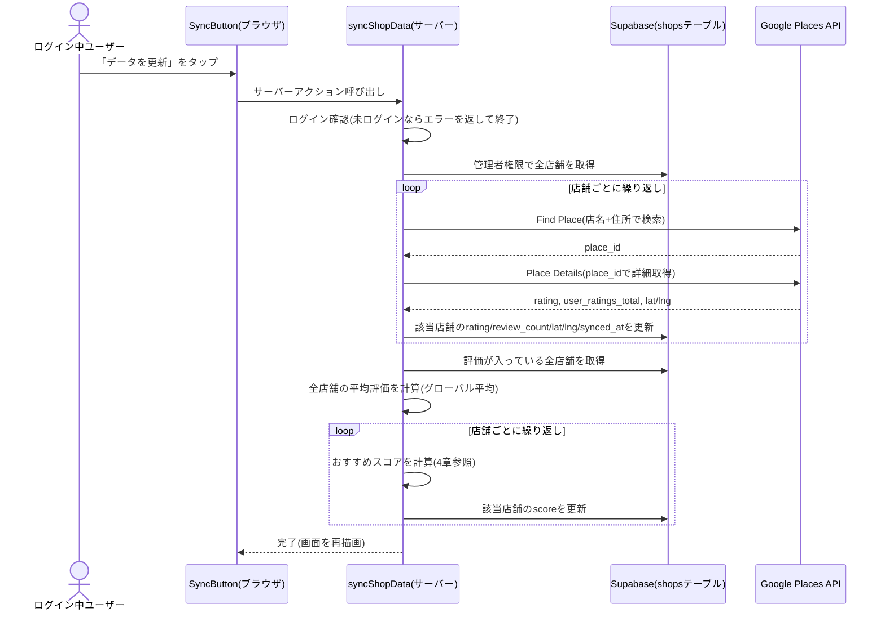
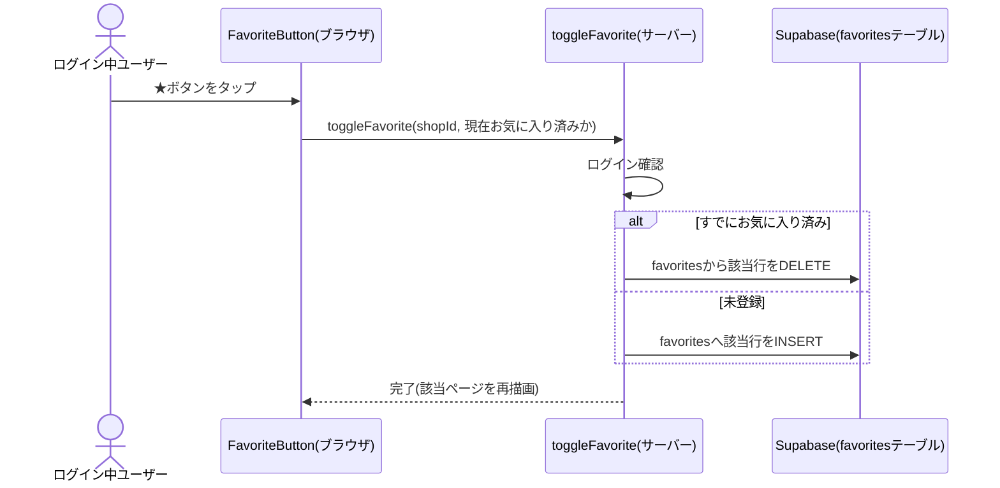
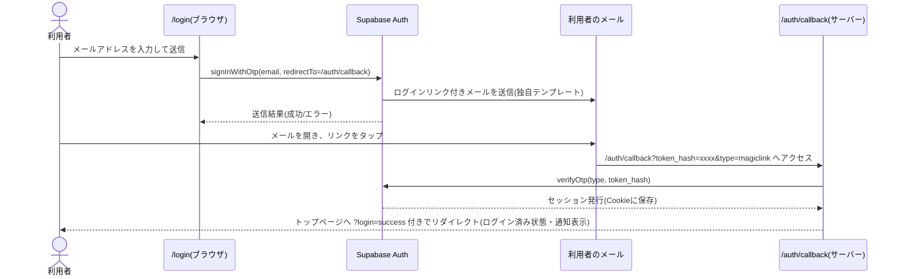

# 詳細設計書

基本設計書([02_basic-design.md](./02_basic-design.md))で定めた構成を、実際にどう実装しているかを定義する。
コードを変更する際は、このドキュメントとコード本体(`jiro-ramen-map/` 配下)を突き合わせて確認すること。

## 1. ディレクトリ構成

```
jiro-ramen-map/
├── app/                          # 画面・ルーティング(Next.js App Router)
│   ├── actions.ts                 # サーバー処理(Server Actions)一式
│   ├── layout.tsx                 # 全画面共通のレイアウト・フォント設定
│   ├── globals.css                # 全画面共通のスタイル
│   ├── page.tsx                   # S1: トップ(地図)画面
│   ├── login/page.tsx             # S2: ログイン画面
│   ├── auth/callback/route.ts     # S3: 認証コールバック(画面を持たないAPIルート)
│   ├── favorites/page.tsx         # S4: お気に入り画面
│   └── shops/new/page.tsx         # S5: 店舗の追加画面
├── components/                   # 画面を構成する部品(コンポーネント)
│   ├── Header.tsx                  # 共通ヘッダー(ナビゲーション・ログイン状態表示)
│   ├── MapExplorer.tsx             # 地図と一覧をまとめた親コンポーネント(選択状態を管理)
│   ├── MapView.tsx                 # Google Mapsの表示・マーカー描画
│   ├── ShopCard.tsx                # 店舗1件分のカードUI
│   ├── FavoriteButton.tsx          # お気に入りの★ボタン
│   ├── SyncButton.tsx              # 「データを更新」ボタン
│   └── AddShopForm.tsx             # 店舗追加フォーム
├── lib/
│   ├── types.ts                    # 型定義(Shop型など)
│   ├── score.ts                    # おすすめスコアの計算ロジック
│   └── supabase/
│       ├── client.ts                # ブラウザ用Supabaseクライアント
│       ├── server.ts                # サーバー用Supabaseクライアント(Cookieでログイン状態を維持)
│       └── admin.ts                 # 管理者用Supabaseクライアント(service role key使用、サーバー専用)
├── middleware.ts                 # 全リクエスト共通のログインセッション更新処理
├── supabase/
│   ├── schema.sql                  # テーブル定義・RLSポリシー(Supabase SQL Editorで実行する)
│   └── seed.sql                    # 初期の店舗データ(店名・住所のみ)
├── docs/                          # このドキュメント一式
├── .env.local.example             # 必要な環境変数の一覧(値は空)
└── README.md                      # セットアップ手順の要約
```

## 2. 画面ごとの詳細仕様

### 2.1 S1: トップ画面(`app/page.tsx`)

- **アクセス制御**: なし(誰でも閲覧可能)
- **表示内容**:
  - ヘッダー(`Header.tsx`)
  - 見出し・説明文
  - ログイン時のみ「データを更新」ボタン(`SyncButton.tsx`)
  - 地図と店舗一覧(`MapExplorer.tsx` → 内部で `MapView.tsx` と `ShopCard.tsx` の一覧を描画)
- **データ取得**:
  1. サーバー側(Reactサーバーコンポーネント)で、ログイン中ユーザー情報を取得
  2. `shops` テーブルを `score` の降順(NULLは最後)で全件取得
  3. ログイン中であれば、そのユーザーの `favorites` を取得し、お気に入り済みの `shop_id` の集合を作る
- **並び替え**: `MapExplorer.tsx` 内で `score` 降順に再ソートしてから表示(取得時点でも同順だが、表示側でも保証している)

### 2.2 S2: ログイン画面(`app/login/page.tsx`)

- クライアントコンポーネント(ブラウザ側でSupabaseの `signInWithOtp` を直接呼び出す)
- **入力**: メールアドレス(必須、`type="email"` によるブラウザ標準バリデーション)
- **送信処理**:
  1. `supabase.auth.signInWithOtp({ email, options: { emailRedirectTo: <このサイトのorigin>/auth/callback } })` を呼び出す
  2. 成功 → 「メールを送信しました」の画面に切り替え
  3. 失敗 → エラーメッセージ(Supabaseから返る `error.message` の内容)を画面に表示
- **状態管理**: `idle` → `sending` → `sent` または `error` の4状態(Reactの `useState`)

### 2.3 S3: 認証コールバック(`app/auth/callback/route.ts`)

- 画面を持たないAPIルート(Route Handler)
- メール内リンクは `https://<サイトURL>/auth/callback?code=xxxx` という形式
- 処理内容:
  1. URLの `code` パラメータを取得
  2. `supabase.auth.exchangeCodeForSession(code)` でログインセッションに交換(Cookieに保存される)
  3. 成功 → `/`(トップ)へリダイレクト
  4. `code` が無い、または交換に失敗 → `/login?error=auth` へリダイレクト

### 2.4 S4: お気に入り画面(`app/favorites/page.tsx`)

- **アクセス制御**: サーバー側で未ログインを検知した場合 `redirect("/login")`
- **データ取得**: `favorites` テーブルと `shops` テーブルを `shop_id` で結合(Supabaseの `.select("shop_id, shops(*)")`)し、
  自分が登録した店舗の情報を取得
- **表示**: `ShopCard.tsx` を並べるのみ(地図は表示しない)

### 2.5 S5: 店舗の追加画面(`app/shops/new/page.tsx`)

- **アクセス制御**: サーバー側で未ログインを検知した場合 `redirect("/login")`
- **入力項目**:

  | 項目 | 必須 | 備考 |
  |---|---|---|
  | 店名 | ○ | |
  | 住所 | ○ | 後述の同期処理でGoogle検索するための文字列として使われる |
  | 都道府県 | - | 任意入力 |

- **送信処理**: `addShop` サーバーアクション(後述)を呼び出す。成功したらトップ画面へ遷移

## 3. サーバー処理(`app/actions.ts`)仕様

Next.jsの Server Actions(`"use server"`)として実装。すべてサーバー側でのみ実行され、ブラウザから直接は呼び出せない。

| 関数 | 呼び出し元 | 処理概要 | 認可 |
|---|---|---|---|
| `signOut()` | `Header.tsx` のログアウトボタン | Supabaseのセッションを破棄し、トップを再描画 | 誰でも呼べるが、未ログイン時は実質何もしない |
| `addShop(formData)` | `AddShopForm.tsx` | `shops` テーブルに1件INSERT | ログイン必須。未ログインならエラーを返す |
| `toggleFavorite(shopId, isFavorited)` | `FavoriteButton.tsx` | `favorites` テーブルへのINSERT/DELETE | ログイン必須 |
| `syncShopData()` | `SyncButton.tsx` | 後述 | ログイン必須 |

### 3.1 `syncShopData()` の処理シーケンス



- 1店舗の取得に失敗しても、`try/catch` で処理を継続し、他の店舗の同期は止めない
- Google Places APIの呼び出しは `NEXT_PUBLIC_GOOGLE_MAPS_API_KEY` を使用(このキーはMaps JavaScript APIとPlaces APIの両方を有効化したものを想定)

### 3.2 `toggleFavorite()` の処理シーケンス



### 3.3 ログイン(マジックリンク)の処理シーケンス



#### なぜ `code`(PKCE)ではなく `token_hash` を使うか

Supabaseのメールテンプレートの初期設定は `{{ .ConfirmationURL }}` という、Supabaseがホストする確認用URLを使う。
このURLは検証後、既定では**トークンをURLのハッシュフラグメント(`#access_token=...`)として付与してリダイレクトする**。
ハッシュフラグメントはブラウザからサーバーへ送信されない情報のため、サーバー側の `/auth/callback` では
一切受け取れず、ログイン処理が常に失敗していた(これが実際に発生した不具合の原因)。

これを避けるため、メールテンプレートを独自のリンク(`{{ .SiteURL }}/auth/callback?token_hash={{ .TokenHash }}&type=magiclink&next=/`)
に書き換え、Supabaseのホスト型確認ページを経由せず、直接 `/auth/callback` へ `token_hash` を渡す方式に変更した。
この方式は、メールを開いたブラウザが送信時のブラウザと異なっていても正しく機能する
(PKCE方式の `code` 交換のように「送信時と同じブラウザでの実行」を前提としない)。

テンプレートの具体的な編集手順は [`04_environment-setup.md`](./04_environment-setup.md) を参照。

## 4. おすすめスコアの計算仕様(`lib/score.ts`)

### 4.1 計算式

ベイズ平均(IMDb方式の加重評価)を採用。

```
score = (n / (n + m)) × rating + (m / (n + m)) × globalAverage
```

| 記号 | 意味 |
|---|---|
| `rating` | その店舗のGoogle評価(5点満点) |
| `n` | その店舗の口コミ数(`review_count`) |
| `globalAverage` | 評価が付いている全店舗の平均評価。1件も無い場合は `4.0` を仮の値として使う |
| `m` | 平滑化定数。**`20`** を採用(口コミ数がこの値に近いほど、店舗自体の評価と全体平均の影響が半々になる) |

### 4.2 この式を採用した理由

- 単純な評価順だと、口コミ1件で★5.0の店が、口コミ500件で★4.6の店より上位に来てしまう
- `m`(20)より口コミ数が少ない店舗ほど、スコアは全体平均に引き寄せられる
- 口コミ数が`m`より十分多い店舗は、ほぼその店自体の評価がそのままスコアになる

### 4.3 実装上の注意

- `review_count` が `0` または未取得(`null`)の店舗はスコア計算の対象外(`score` は `null` のまま)
- 一覧表示では `score` が `null` の店舗は末尾に表示される(`nullsFirst: false` で取得)

## 5. データベース詳細設計(`supabase/schema.sql`)

### 5.1 `shops` テーブル

| カラム名 | 型 | NULL | デフォルト | 説明 |
|---|---|---|---|---|
| `id` | `uuid` | NOT NULL | `gen_random_uuid()` | 主キー |
| `name` | `text` | NOT NULL | - | 店名 |
| `address` | `text` | NOT NULL | - | 住所(Google検索のクエリとしても使用) |
| `prefecture` | `text` | NULL可 | - | 都道府県(任意入力) |
| `lat` | `double precision` | NULL可 | - | 緯度。同期処理で取得するまでは空 |
| `lng` | `double precision` | NULL可 | - | 経度。同上 |
| `google_place_id` | `text` | NULL可・UNIQUE | - | GoogleのPlace ID |
| `rating` | `numeric(2,1)` | NULL可 | - | Google評価(例: `4.5`) |
| `review_count` | `integer` | NULL可 | - | Googleの口コミ数 |
| `score` | `numeric(5,4)` | NULL可 | - | おすすめスコア(4章参照) |
| `synced_at` | `timestamptz` | NULL可 | - | 最後に同期した日時 |
| `created_by` | `uuid` | NULL可 | - | 追加したユーザーのID(`auth.users.id` への外部キー、`on delete set null`) |
| `created_at` | `timestamptz` | NOT NULL | `now()` | 作成日時 |

インデックス: `shops_score_idx`(`score` 降順、NULLは最後)

### 5.2 `favorites` テーブル

| カラム名 | 型 | NULL | 説明 |
|---|---|---|---|
| `user_id` | `uuid` | NOT NULL | `auth.users.id` への外部キー(`on delete cascade`)。主キーの一部 |
| `shop_id` | `uuid` | NOT NULL | `shops.id` への外部キー(`on delete cascade`)。主キーの一部 |
| `created_at` | `timestamptz` | NOT NULL | 登録日時(デフォルト `now()`) |

主キー: (`user_id`, `shop_id`) の複合主キー(同じ店を二重登録できない)
インデックス: `favorites_user_id_idx`(`user_id`)

### 5.3 行レベルセキュリティ(RLS)ポリシー一覧

| テーブル | ポリシー名 | 対象操作 | 対象ロール | 条件 |
|---|---|---|---|---|
| `shops` | shops are viewable by everyone | SELECT | 全員 | 常に許可(`true`) |
| `shops` | authenticated users can add shops | INSERT | ログインユーザー | 常に許可(`true`)。更新・削除のポリシーは無いため、クライアントからの更新・削除は不可 |
| `favorites` | users can view their own favorites | SELECT | ログインユーザー | `auth.uid() = user_id` |
| `favorites` | users can add their own favorites | INSERT | ログインユーザー | `auth.uid() = user_id` |
| `favorites` | users can remove their own favorites | DELETE | ログインユーザー | `auth.uid() = user_id` |

`shops` の更新・削除(評価やスコアの書き込みなど)は、RLSを無視できる管理者クライアント(`lib/supabase/admin.ts`、
service role key使用)によって、サーバー側の `syncShopData()` からのみ行われる。

## 6. Supabaseクライアントの使い分け

| ファイル | 用途 | 使用する鍵 | 呼び出せる場所 |
|---|---|---|---|
| `lib/supabase/client.ts` | ブラウザから直接Supabaseへアクセス(ログイン画面など) | `NEXT_PUBLIC_SUPABASE_ANON_KEY` | クライアントコンポーネント(`"use client"`) |
| `lib/supabase/server.ts` | サーバー側でCookieのログイン状態を見ながらアクセス | `NEXT_PUBLIC_SUPABASE_ANON_KEY` | サーバーコンポーネント・Server Actions |
| `lib/supabase/admin.ts` | RLSを無視した管理者アクセス | `SUPABASE_SERVICE_ROLE_KEY` | `syncShopData()` など、サーバー専用処理のみ。**ブラウザに渡してはいけない** |

## 7. 地図表示(`components/MapView.tsx`)の実装仕様

- `@googlemaps/js-api-loader` を使い、`NEXT_PUBLIC_GOOGLE_MAPS_API_KEY` でGoogle Maps JavaScript APIを読み込む
- マーカーは `google.maps.Marker`(従来型API)を使用。Google推奨の新API(`AdvancedMarkerElement`)は、
  Google Cloud側で追加のMap ID発行が必要となり設定コストが増えるため、本アプリでは採用していない
- `lat` / `lng` を持つ店舗のみ地図に表示する(未同期の店舗は地図には出ず、一覧には「未取得」と表示される)
- マーカー・一覧のどちらかをクリックすると、選択状態(`selectedShopId`)が更新され、地図が該当店舗の位置にパンする

## 8. 既知の制約・注意点

- **npmのローカルビルド確認について**: 開発環境からnpmレジストリへのネットワークアクセスができないため、
  コードの変更はVercel上のビルドで初めて型チェックされる。変更後は必ずデプロイ結果を確認すること
- **Supabase無料プランのメール送信制限**: マジックリンクの送信には1時間あたり数通程度の制限がある。
  本格的に使う場合は `04_environment-setup.md` の「独自SMTPへの切り替え」を検討すること
- **住所データの正確性**: `supabase/seed.sql` の初期店舗リストの住所は一般的な情報を元にしたものであり、
  正確性は保証されない。誤りに気づいた場合は直接修正するか、店舗追加画面から正しい情報を登録すること
