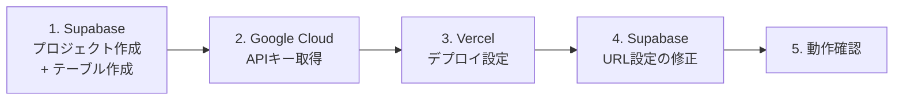

# 環境構築手順書

このアプリを新しい環境(新しいSupabase/Google Cloud/Vercelアカウントなど)にゼロから構築するための手順書。
実際にこのアプリを開発した際に発生したエラーとその対処法も「トラブルシューティング」にまとめている。

## 0. 全体の流れ



Vercelでのデプロイ(手順3)より前にSupabaseとGoogle CloudのAPIキーを用意しておく必要がある
(Vercelの環境変数として登録するため)。また、Vercelのデプロイ完了後、実際に発行されたURLを
Supabase側に登録し直す作業(手順4)が必要になる点に注意。

## 1. Supabaseのセットアップ

### 1.1 プロジェクト作成

1. https://supabase.com を開き、GitHubアカウントでログイン
2. 「New Project」から新規プロジェクトを作成(プロジェクト名は任意、リージョンは `Northeast Asia (Tokyo)` 推奨)

### 1.2 テーブルの作成

1. 左メニューの **「SQL Editor」** を開く
2. 「New query」を選び、[`../supabase/schema.sql`](../supabase/schema.sql) の中身をすべてコピーして貼り付け、**Run**
3. 同様に [`../supabase/seed.sql`](../supabase/seed.sql) の中身を貼り付けて **Run**(初期の店舗データ12件が登録される)
4. 左メニューの **「Table Editor」** を開き、`shops`(12件)と `favorites`(0件)のテーブルができていることを確認

### 1.3 APIキーの取得

1. 左メニューの **「Project Settings」**(歯車アイコン)→ **「API」** または **「API Keys」**
2. 以下の値をメモしておく(あとでVercelに登録する)
   - **Project URL**
   - **Publishable key**(`sb_publishable_...` から始まるもの。旧称: anon / public key)
   - **Secret key**(`sb_secret_...` から始まるもの。⚠️ 絶対に公開しないこと)

### 1.4 ログイン用メールテンプレートの編集(必須)

初期設定のままだと、ログインメールのリンクをタップしてもログイン状態にならない不具合が発生する
(理由は [`03_detailed-design.md`](./03_detailed-design.md) の「3.3 ログインの処理シーケンス」を参照)。
必ず以下の手順でテンプレートを書き換えること。

1. 左メニューの **「Authentication」** → **「Email Templates」** → **「Magic Link」** を開く
2. 本文中の `<a href="{{ .ConfirmationURL }}">Log In</a>` の行を、以下の内容に書き換える
   ```html
   <a href="{{ .SiteURL }}/auth/callback?token_hash={{ .TokenHash }}&type=magiclink&next=/">Log In</a>
   ```
3. **「Save」**

## 2. Google Cloudのセットアップ

### 2.1 プロジェクト作成・課金設定

1. https://console.cloud.google.com/ を開き、Googleアカウントでログイン
2. 「新しいプロジェクト」を作成(名前は任意)
3. 左メニュー →「お支払い」から課金アカウントを作成し、クレジットカードを登録
   - 個人利用の規模では通常課金は発生しない(詳細は本ドキュメント末尾の「料金について」を参照)

### 2.2 APIの有効化

1. 左メニュー →「APIとサービス」→「ライブラリ」
2. 以下の2つを検索し、それぞれ「有効にする」
   - **Maps JavaScript API**
   - **Places API**

### 2.3 APIキーの取得

1. 左メニュー →「APIとサービス」→「認証情報」→「+ 認証情報を作成」→「APIキー」
2. 生成されたキー(`AIza...`)をメモしておく
3. (推奨・後回し可)キーをタップして編集し、「アプリケーションの制限」で「HTTPリファラー」を選択、
   手順3でVercelのURLが分かった後に、そのURLを登録する

## 3. Vercelのセットアップ

### 3.1 プロジェクトのインポート

1. https://vercel.com を開き、GitHubアカウントでログイン
2. 「Add New...」→「Project」
3. 対象のGitHubリポジトリ(このアプリが入っているリポジトリ)を選択し「Import」

### 3.2 Root Directoryの設定

このアプリは、リポジトリのルートではなく `jiro-ramen-map` フォルダの中にある。そのため、
「Configure Project」画面(初回インポート時)または「Settings → General」(インポート後)の
**「Root Directory」** を、**`jiro-ramen-map`** に設定すること。

- 初回インポート時: 「Root Directory」の「Edit」から入力
- インポート後に変更する場合: プロジェクトの「Settings」→「General」→「Root Directory」の「Edit」から入力し、
  保存後に「Deployments」タブから最新のデプロイを「Redeploy」する

### 3.3 環境変数の登録

「Environment Variables」に、以下の4つを登録する(Key / Valueの組で1行ずつ追加)。

| Key | Value | 取得元 |
|---|---|---|
| `NEXT_PUBLIC_SUPABASE_URL` | SupabaseのProject URL | 手順1.3 |
| `NEXT_PUBLIC_SUPABASE_ANON_KEY` | Supabaseの Publishable key | 手順1.3 |
| `SUPABASE_SERVICE_ROLE_KEY` | Supabaseの Secret key | 手順1.3。⚠️取り扱い注意 |
| `NEXT_PUBLIC_GOOGLE_MAPS_API_KEY` | Google CloudのAPIキー | 手順2.3 |

登録後、「Deploy」をタップする。

## 4. Supabase側のURL設定を修正(デプロイ後に必要)

Vercelのデプロイが完了すると、`https://<プロジェクト名>-xxxx.vercel.app` のようなURLが発行される。
このURLを、Supabase側の認証設定に反映する必要がある(反映しないと、ログインメールのリンクが
`localhost:3000` に飛んでしまい、ログインできない)。

1. Supabaseのプロジェクトで、左メニューの **「Authentication」** → **「URL Configuration」**
2. **「Site URL」** を、Vercelで発行された実際のURLに書き換える
3. **「Redirect URLs」** に、同じURLの末尾に `/**` を付けたものを追加(例: `https://xxxx.vercel.app/**`)
4. **「Save」**

## 5. 動作確認

1. VercelのURLをブラウザで開く
2. 右上の「ログイン」→メールアドレスを入力→送信
3. 届いたメールのリンクをタップ→ログイン済み状態でトップページに戻ることを確認
4. トップページの「データを更新(Googleから評価を取得)」を押す
5. 数十秒待ち、地図にマーカーが表示され、一覧に評価・口コミ数が表示されれば構築完了

## 6. トラブルシューティング

実際の開発時に発生した事例を含む。同じ症状が出た場合はここを確認する。

### 6.1 ビルドが `Type error` で失敗する

Vercelの「Deployments」→該当デプロイ→「Build Logs」でエラー内容を確認する。
このプロジェクトでは開発環境からnpmへのネットワークアクセスができず、ローカルでのビルド確認ができないため、
型エラーがVercelのビルドで初めて見つかることがある。エラーメッセージ・該当ファイル名・行番号を
そのまま開発担当(Claudeなど)に共有すれば、通常は数分で修正できる。

**発生事例1**: `startTransition` に渡した関数がPromiseを返していたことによる型エラー
→ `void 関数呼び出し()` の形でラップし、戻り値を返さないようにして解消。

**発生事例2**: Supabaseのcookie設定オブジェクトの引数に型注釈が無く `implicitly has an 'any' type` エラー
→ `@supabase/ssr` の `CookieOptions` 型を使って明示的に型注釈を追加して解消。

### 6.2 ログインメールのリンクが `localhost:3000` に飛ぶ

→ 本ドキュメントの「4. Supabase側のURL設定を修正」がまだ行われていない。Site URL / Redirect URLsを
実際のVercel URLに書き換えること。

### 6.3 ログインで「送信に失敗しました」と表示される

1. Supabaseの左メニュー「Logs」→「Auth」で最新のログを確認する
2. `error_code` が `over_email_send_rate_limit` の場合 → Supabase無料プランのメール送信レート制限
   (1時間あたり数通程度)に達している。**この制限はSupabaseの仕様であり、アプリ側のバグではない**。
   - 短期的な対処: 1時間程度待ってから再度試す。連続で何度も送信ボタンを押さない
   - 恒久対処: Supabaseの「Authentication → SMTP Settings」で、Resendなど無料の独自SMTPサービスに
     切り替えると、この制限を受けなくなる(1日あたり数十〜数百通程度に緩和される)

### 6.4 Supabaseで「GitHubと接続してください」のような表示が出る

→ 本アプリの構築方法では、SupabaseとGitHubの連携機能(マイグレーション自動反映・ブランチ機能)は
**使用しない**。`supabase/schema.sql` と `supabase/seed.sql` を「SQL Editor」に貼り付けて手動実行するだけでよい。

### 6.5 地図にマーカーが表示されない / 評価が「未取得」のまま

→ ログイン後に「データを更新」ボタンを一度も押していない可能性が高い。押しても変化がない場合は、
Google CloudでMaps JavaScript API / Places APIが有効化されているか、APIキーがVercelに正しく登録されているかを確認する。

### 6.6 メールのリンクをタップしても、ログイン状態になったか分からない

→ 「1.4 ログイン用メールテンプレートの編集」がまだ行われていない場合、これが原因である可能性が高い。
初期設定のテンプレートは、ログイン情報をURLの見えない部分(ハッシュフラグメント)に載せて返す方式のため、
サーバー側の処理(`/auth/callback`)がそれを一切受け取れず、ログインが常に失敗する。1.4の手順を行うこと。

設定済みのはずなのに再現する場合は、`/login` に `?error=auth` が付いた状態で戻ってきていないか確認する
(その場合は赤字でエラーメッセージが表示されるようになっている)。それでも解決しない場合は、Supabaseの
「Logs → Auth」で `/callback` 関連の直近のログを確認し、内容を共有すること。

### 6.7 店舗一覧をタップしても地図が反応しないように見える

→ v1.1(このドキュメントの初版)時点では、選択時の反応が「地図を少しパンするだけ」で分かりにくかった。
現在は選択した店舗にズームインし、店名・評価を示す吹き出し(InfoWindow)が表示されるよう改善済み。
それでも反応が無い場合は、対象の店舗がまだ「データを更新」で座標(緯度経度)を取得できていない可能性が高い
(住所からGoogle検索がヒットしなかった店舗は地図上にマーカー自体が存在しない)。一覧の評価が「未取得」のままに
なっていないか確認すること。

## 7. 料金について(参考)

個人利用の規模であれば、基本的に無料(¥0)で運用できる。

| サービス | 無料枠の目安 | 注意点 |
|---|---|---|
| Vercel(Hobby) | 月100GB通信・100万アクセスまで無料 | 個人・非商用利用限定 |
| Supabase(Free) | DB 500MB、月間アクティブユーザー50,000人まで無料 | 1週間アクセスが無いと自動一時停止(データは消えない、手動再開可) |
| Google Maps Platform | 地図表示・住所変換は月10,000回まで無料 | Places Details(評価取得)は無料枠超過分が高額(1,000回あたり$32)。
本アプリは「データを更新」ボタンでのみ呼び出す設計のため、通常は無料枠内に収まる想定 |

Google Cloud側で「予算アラート」を設定しておくと、想定外の請求を未然に防げる
(「お支払い」→「予算とアラート」から設定可能)。
