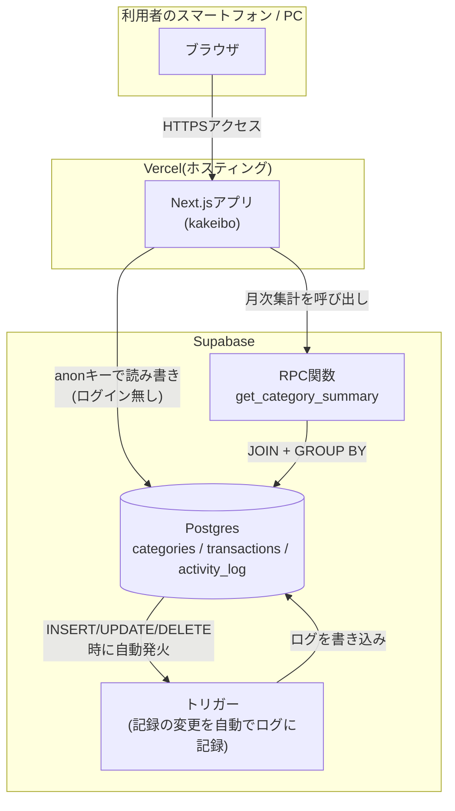
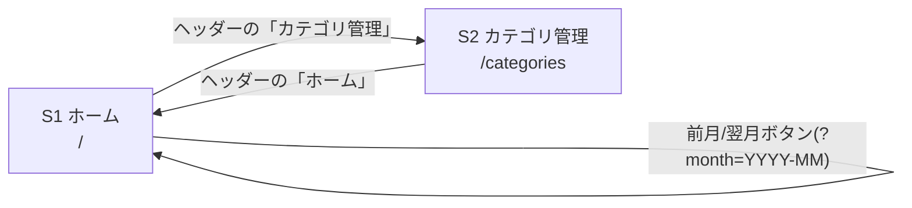
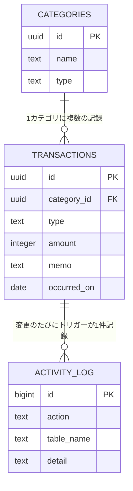

# 基本設計書

要件定義書([01_requirements.md](./01_requirements.md))で定めた要件を、どのような構成で実現するかを定義する。

## 1. システム構成

### 1.1 全体構成図

### 1.2 採用technology stack

| 分類 | 採用技術 | 採用理由 |
|---|---|---|
| フロントエンド/バックエンド | Next.js(App Router) + TypeScript | 画面(フロント)とサーバー処理(バックエンド)を1つのプロジェクトで書けるため、構成をシンプルにできる |
| ホスティング | Vercel | GitHubと連携し、pushするだけで自動デプロイされる。個人利用は無料 |
| データベース | Supabase(PostgreSQL) | テーブル・トリガー・SQL関数(RPC)・行レベルセキュリティを無料で使える |

### 1.3 なぜこの構成にしたか

- 個人1人での利用に限定しているため、**認証機能(Supabase Auth)はあえて使わない**。
  ログイン画面・セッション管理・cookie処理を持たないことで、構成をシンプルに保っている
- 「データベースの動きを学ぶ」という目的のため、集計処理はアプリ側のJavaScriptで行わず、
  **SQL関数(RPC)としてデータベース側に実装**している(2.3参照)
- 同様の理由で、操作ログはアプリのコードが書き込むのではなく、**データベースのトリガー**が
  自動的に記録する構成にしている

## 2. 画面設計

### 2.1 画面一覧

| # | 画面名 | パス | 概要 |
|---|---|---|---|
| S1 | ホーム(ダッシュボード) | `/` | 月次サマリー・カテゴリ別内訳・記録一覧・記録フォーム・操作ログを表示 |
| S2 | カテゴリ管理 | `/categories` | カテゴリの一覧表示・追加 |

ログイン機能を持たないため、上記2画面はすべて誰でもアクセス・操作できる。

### 2.2 画面遷移図

## 3. データベース設計(概要)

詳細なカラム定義は [03_detailed-design.md](./03_detailed-design.md) を参照。ここでは全体像のみを示す。

- `TRANSACTIONS` → `ACTIVITY_LOG` の矢印は外部キーではなく、「トリガーが結果として1行書き込む」という関係を表す
- `user_id`列は持たない(個人1人での利用に限定しているため)

## 4. 外部インターフェース

| 連携先 | 用途 | 認証方法 |
|---|---|---|
| Supabase Database(テーブル) | 記録・カテゴリ・操作ログの読み書き | anonキー(RLSで「誰でも可」に設定) |
| Supabase Database(RPC関数) | 月次のカテゴリ別集計 | 同上 |

外部のAPI連携(地図・決済など)は無い。

## 5. 非機能設計

### 5.1 セキュリティ設計

- ログイン機能が無いため、RLSは「anonロールに対して常に許可」というポリシーで統一している
  (「無効化」ではなく「意図的に開放したポリシー」にすることで、将来ログインを復活させる場合に
  ポリシーの条件式を差し替えるだけで済むようにしている)
- 家計の情報を他人に見られたくない場合は、アプリ側にログイン機能を作り込むのではなく、
  Vercelの「Deployment Protection(パスワード保護)」でサイト全体にアクセス制限を掛けることを推奨する

### 5.2 データベースの動きを可視化する設計

- **CRUD**: 記録の追加・編集・削除は、Server Actions(`app/actions.ts`)からテーブルへの
  素直な`insert` / `update` / `delete`として実装
- **集計(JOIN + GROUP BY)**: カテゴリ別内訳は、`get_category_summary`というSQL関数(RPC)が
  `transactions`と`categories`をJOINし`GROUP BY`で集計した結果をそのまま返す。アプリ側では集計しない
- **トリガーによる自動ログ**: `transactions`テーブルへのAFTER INSERT/UPDATE/DELETEトリガーが、
  データベース自身の判断で`activity_log`に1行書き込む。アプリのコードはこのログに一切関与しない

詳細な実装は [03_detailed-design.md](./03_detailed-design.md) を参照。
