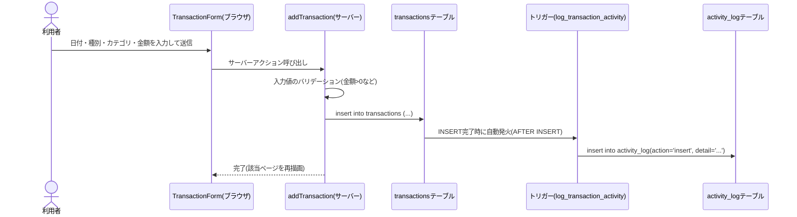
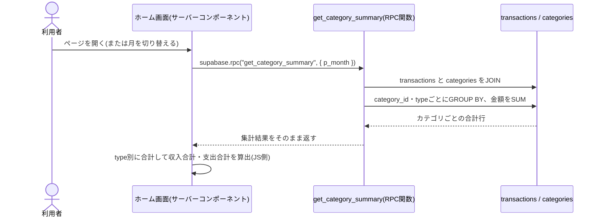

# 詳細設計書

基本設計書([02_basic-design.md](./02_basic-design.md))で定めた構成を、実際にどう実装しているかを定義する。
コードを変更する際は、このドキュメントとコード本体(`kakeibo/` 配下)を突き合わせて確認すること。

## 1. ディレクトリ構成

```
kakeibo/
├── app/
│   ├── actions.ts               # サーバー処理(Server Actions)一式
│   ├── layout.tsx                # 全画面共通のレイアウト・フォント設定
│   ├── globals.css               # 全画面共通のスタイル
│   ├── page.tsx                  # S1: ホーム(ダッシュボード)画面
│   └── categories/page.tsx       # S2: カテゴリ管理画面
├── components/
│   ├── Header.tsx                  # 共通ヘッダー(ナビゲーションのみ。ログイン表示は無い)
│   ├── MonthNav.tsx                 # 前月/翌月の切り替えリンク
│   ├── SummaryCards.tsx             # 収入・支出・収支のカード表示
│   ├── CategoryBreakdown.tsx        # カテゴリ別内訳の棒グラフ
│   ├── ActivityLog.tsx              # データベース操作ログの一覧
│   ├── TransactionForm.tsx          # 記録の追加フォーム
│   ├── TransactionList.tsx          # 記録一覧(TransactionRowの親)
│   ├── TransactionRow.tsx           # 記録1件分の行(編集フォームへの切り替えも含む)
│   └── CategoryForm.tsx             # カテゴリ追加フォーム
├── lib/
│   ├── types.ts                    # 型定義(Category / Transaction など)
│   ├── format.ts                   # 金額・日付・月のフォーマット関数
│   └── supabase/
│       └── server.ts                # Supabaseクライアント(anonキーのみ。cookie/認証は使わない)
├── supabase/
│   ├── schema.sql                  # テーブル定義・RLSポリシー・トリガー・RPC関数
│   └── seed.sql                    # 初期カテゴリ
├── docs/                          # このドキュメント一式
├── .env.local.example             # 必要な環境変数の一覧(値は空)
└── README.md                      # セットアップ手順の要約
```

ログイン機能を廃止したため、`middleware.ts`・`app/login/`・`app/auth/callback/`・
`lib/supabase/client.ts` は存在しない(以前のバージョンには存在した)。

## 2. 画面ごとの詳細仕様

### 2.1 S1: ホーム画面(`app/page.tsx`)

- **アクセス制御**: なし
- **`export const dynamic = "force-dynamic"`** を指定している。認証(cookie)を使わなくなったことで
  Next.jsがこのページを静的ページとして扱おうとし、ビルド時にSupabaseへの接続を試みて失敗するため、
  明示的に「毎回サーバーで描画する」動的ページに固定している
- **URLパラメータ**: `?month=YYYY-MM`(省略時は当月)
- **表示内容**: ヘッダー、月切り替え(`MonthNav`)、サマリー(`SummaryCards`)、記録フォーム
  (`TransactionForm`)、記録一覧(`TransactionList`)、カテゴリ別内訳(`CategoryBreakdown`)、
  操作ログ(`ActivityLog`)
- **データ取得**(`Promise.all`で並列に取得):
  1. `categories` テーブルを全件取得(種別→名前の順で並び替え)
  2. `transactions` テーブルから、表示中の月に該当する記録を`categories(name)`と結合して取得
     (`occurred_on >= 月初` かつ `occurred_on < 翌月初`)
  3. `get_category_summary(p_month)` をRPC呼び出しし、その月のカテゴリ別合計を取得
  4. `activity_log` テーブルから最新8件を取得
- **集計**: RPCの結果(`CategorySummary[]`)を`type`ごとにフィルタして合計し、収入合計・支出合計を算出
  (収支はその差分)

### 2.2 S2: カテゴリ管理画面(`app/categories/page.tsx`)

- **アクセス制御**: なし
- `export const dynamic = "force-dynamic"` を指定(理由はS1と同じ)
- **データ取得**: `categories` テーブルを全件取得し、`type`で支出/収入に分けて一覧表示
- **入力**: カテゴリ名(必須・30文字まで)、種別(支出/収入)

## 3. サーバー処理(`app/actions.ts`)仕様

Next.jsの Server Actions(`"use server"`)として実装。すべてサーバー側でのみ実行され、ブラウザから直接は呼び出せない。

| 関数 | 呼び出し元 | 処理概要 |
|---|---|---|
| `addTransaction(formData)` | `TransactionForm.tsx` | `transactions` テーブルに1件INSERT |
| `updateTransaction(id, formData)` | `TransactionRow.tsx`(編集フォーム) | 該当行をUPDATE |
| `deleteTransaction(id)` | `TransactionRow.tsx`(削除ボタン) | 該当行をDELETE |
| `addCategory(formData)` | `CategoryForm.tsx` | `categories` テーブルに1件INSERT |

ログイン機能が無いため、これらの関数はいずれも「誰が呼んだか」を確認しない。アクセス制御は
データベース側のRLSポリシー(5.3参照)に委ねている。

### 3.1 記録追加の処理シーケンス(データベースの動きが見えるポイント)



- 編集(UPDATE)・削除(DELETE)も同様に、DB側のトリガーが自動的に`activity_log`へ書き込む
- `detail`列の文言(例:「2026-09-18 / 食費 / 1200円 を記録しました」)は、トリガー関数内で
  `format()`関数を使って組み立てている(5.4参照)

### 3.2 カテゴリ別内訳の取得シーケンス(集計処理が見えるポイント)



- アプリのコードは「集計されたあとの行」を受け取るだけで、SUMやGROUP BYそのものはデータベース側が行う

## 4. データベース詳細設計(`supabase/schema.sql`)

### 4.1 `categories` テーブル

| カラム名 | 型 | NULL | デフォルト | 説明 |
|---|---|---|---|---|
| `id` | `uuid` | NOT NULL | `gen_random_uuid()` | 主キー |
| `name` | `text` | NOT NULL | - | カテゴリ名 |
| `type` | `text` | NOT NULL | - | `income`(収入)または`expense`(支出) |
| `created_at` | `timestamptz` | NOT NULL | `now()` | 作成日時 |

制約: `(name, type)` の組み合わせがUNIQUE(同じ種別で同名カテゴリを重複登録できない)

### 4.2 `transactions` テーブル

| カラム名 | 型 | NULL | デフォルト | 説明 |
|---|---|---|---|---|
| `id` | `uuid` | NOT NULL | `gen_random_uuid()` | 主キー |
| `category_id` | `uuid` | NOT NULL | - | `categories.id` への外部キー(`on delete restrict`) |
| `type` | `text` | NOT NULL | - | `income` または `expense` |
| `amount` | `integer` | NOT NULL | - | 金額(`amount > 0`の制約あり) |
| `memo` | `text` | NULL可 | - | メモ(任意) |
| `occurred_on` | `date` | NOT NULL | - | 発生日 |
| `created_at` | `timestamptz` | NOT NULL | `now()` | 作成日時 |

インデックス: `transactions_occurred_idx`(`occurred_on` 降順)

### 4.3 `activity_log` テーブル

| カラム名 | 型 | NULL | デフォルト | 説明 |
|---|---|---|---|---|
| `id` | `bigint` | NOT NULL | `generated always as identity` | 主キー |
| `action` | `text` | NOT NULL | - | `insert` / `update` / `delete` |
| `table_name` | `text` | NOT NULL | - | 対象テーブル名(現状は常に`transactions`) |
| `detail` | `text` | NOT NULL | - | 人が読める形式の操作内容(例文は3.1参照) |
| `created_at` | `timestamptz` | NOT NULL | `now()` | 記録日時 |

インデックス: `activity_log_created_idx`(`created_at` 降順)

このテーブルへの書き込みはアプリのコードからは行わない。**すべて4.4のトリガーが書き込む**。

### 4.4 トリガー(`log_transaction_activity`)

```sql
create trigger trg_log_transaction_activity
after insert or update or delete on transactions
for each row execute function log_transaction_activity();
```

- `transactions` への行の追加・更新・削除のたびに、行ごとに1回実行される(`for each row`)
- 関数内で`tg_op`(`INSERT`/`UPDATE`/`DELETE`)を判定し、対応する`action`値で`activity_log`に1行INSERTする
- `security definer`(関数の作成者の権限で実行)かつ`set search_path = public`を指定しており、
  anonロールで呼ばれる通常のINSERT/UPDATE/DELETEからでも、確実に`activity_log`へ書き込める
- トリガー関数自体はAPI経由で直接呼び出せないよう、`revoke execute ... from public, anon, authenticated`
  で実行権限を剥奪している(トリガーとしての自動発火はこれとは独立して動作する)

### 4.5 RPC関数(`get_category_summary`)

```sql
create function get_category_summary(p_month date)
returns table (category_id uuid, category_name text, type text, total numeric)
language sql
stable
as $$
  select c.id, c.name, t.type, sum(t.amount) as total
  from transactions t
  join categories c on c.id = t.category_id
  where t.occurred_on >= p_month
    and t.occurred_on < (p_month + interval '1 month')
  group by c.id, c.name, t.type
  order by total desc;
$$;
```

- 引数`p_month`には月初日(例: `2026-09-01`)を渡す
- `transactions`と`categories`をJOINし、カテゴリ・種別ごとに`GROUP BY`で合計する典型的な集計クエリ
- `language sql`(PL/pgSQLではない、素のSQL関数)で、`stable`(同一トランザクション内では同じ引数に対し
  同じ結果を返す)を指定している

### 4.6 行レベルセキュリティ(RLS)ポリシー一覧

| テーブル | ポリシー名 | 対象操作 | 条件 |
|---|---|---|---|
| `categories` | anyone can view categories | SELECT | 常に許可(`true`) |
| `categories` | anyone can add categories | INSERT | 常に許可(`true`) |
| `transactions` | anyone can view transactions | SELECT | 常に許可(`true`) |
| `transactions` | anyone can add transactions | INSERT | 常に許可(`true`) |
| `transactions` | anyone can update transactions | UPDATE | 常に許可(`true`) |
| `transactions` | anyone can delete transactions | DELETE | 常に許可(`true`) |
| `activity_log` | anyone can view activity log | SELECT | 常に許可(`true`) |

いずれも「anonロールを含む誰でも許可」という、意図的に開放したポリシーになっている
(要件定義書 3.3 のとおり、ログイン機能を持たないための設計判断)。

## 5. Supabaseクライアント(`lib/supabase/server.ts`)

```ts
export function createClient() {
  return createSupabaseClient(
    process.env.NEXT_PUBLIC_SUPABASE_URL!,
    process.env.NEXT_PUBLIC_SUPABASE_ANON_KEY!
  );
}
```

- `@supabase/supabase-js` の素のクライアント。cookieの読み書きやセッション管理は行わない
  (認証機能を使わないため不要)
- サーバーコンポーネント・Server Actionsの両方から同じ関数を呼び出す

## 6. 既知の制約・注意点

- **ログイン機能が無い**ため、URLとanonキーを知っている人は誰でも読み書きできる。個人利用の範囲を超えて
  公開する場合は、Vercelの「Deployment Protection」等で別途アクセス制限を行うこと(README参照)
- **カテゴリの編集・削除機能は無い**(追加のみ)。誤ったカテゴリ名を直したい場合は、現状はSupabaseの
  「Table Editor」から直接編集する必要がある
- **npmのローカルビルド確認について**: 開発環境からnpmレジストリへのネットワークアクセスができない場合があり、
  その場合コードの変更はVercel上のビルドで初めて型チェックされる
