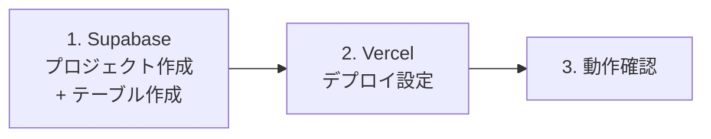

# 環境構築手順書

このアプリを新しい環境(新しいSupabase/Vercelアカウントなど)にゼロから構築するための手順書。

## 0. 全体の流れ



`jiro-ramen-map`と異なり、外部APIキー(Google Maps等)は不要で、SupabaseとVercelの2つだけで完結する。

## 1. Supabaseのセットアップ

### 1.1 プロジェクト作成

1. https://supabase.com を開き、GitHubアカウントでログイン
2. 「New Project」から新規プロジェクトを作成(プロジェクト名は任意、リージョンは `Northeast Asia (Tokyo)` 推奨)

### 1.2 テーブルの作成

1. 左メニューの **「SQL Editor」** を開く
2. 「New query」を選び、[`../supabase/schema.sql`](../supabase/schema.sql) の中身をすべてコピーして貼り付け、**Run**
   (テーブル・RLSポリシー・トリガー・RPC関数がまとめて作成される)
3. 同様に [`../supabase/seed.sql`](../supabase/seed.sql) の中身を貼り付けて **Run**(初期カテゴリ13件が登録される)
4. 左メニューの **「Table Editor」** を開き、`categories`(13件)・`transactions`(0件)・`activity_log`(0件)の
   テーブルができていることを確認

### 1.3 APIキーの取得

1. 左メニューの **「Project Settings」**(歯車アイコン)→ **「API」** または **「API Keys」**
2. 以下の値をメモしておく(あとでVercelに登録する)
   - **Project URL**
   - **Publishable key**(`sb_publishable_...` から始まるもの。旧称: anon / public key)

`service role key`(管理者鍵)は本アプリでは使用しない(RLSを意図的に開放しているため、
管理者権限で回避する必要がある処理が無い)。

## 2. Vercelのセットアップ

### 2.1 プロジェクトのインポート

1. https://vercel.com を開き、GitHubアカウントでログイン
2. 「Add New...」→「Project」
3. 対象のGitHubリポジトリ(このアプリが入っているリポジトリ)を選択し「Import」

### 2.2 Root Directoryの設定

このアプリは、リポジトリのルートではなく `kakeibo` フォルダの中にある。そのため、
「Configure Project」画面(初回インポート時)または「Settings → General」(インポート後)の
**「Root Directory」** を、**`kakeibo`** に設定すること。

### 2.3 環境変数の登録

「Environment Variables」に、以下の2つを登録する(Key / Valueの組で1行ずつ追加。
Environmentは Production / Preview / Development すべてにチェック)。

| Key | Value | 取得元 |
|---|---|---|
| `NEXT_PUBLIC_SUPABASE_URL` | SupabaseのProject URL | 手順1.3 |
| `NEXT_PUBLIC_SUPABASE_ANON_KEY` | Supabaseの Publishable key | 手順1.3 |

登録後、「Deploy」をタップする。

## 3. 動作確認

1. VercelのURLをブラウザで開く(ログイン画面は無いので、開けばそのままホーム画面が表示される)
2. 「記録する」フォームから、適当な支出を1件登録する
3. 右側の「データベース操作ログ」に、今追加した記録の内容が自動で表示されることを確認する
4. 記録一覧の「編集」「削除」ボタンが動作することを確認する
5. `/categories` を開き、新しいカテゴリを追加できることを確認する

## 4. トラブルシューティング

### 4.1 ビルドが `supabaseUrl is required` で失敗する

Vercelに環境変数(2.3)が登録されていない、またはRoot Directoryの設定(2.2)が誤っている可能性が高い。
「Settings → Environment Variables」と「Settings → General → Root Directory」を確認し、
修正後は「Deployments」タブから最新のデプロイを「Redeploy」する。

### 4.2 ページを開いてもデータが表示されない/エラーになる

1. Supabaseで `supabase/schema.sql` → `supabase/seed.sql` の順に実行済みか確認する(1.2)
2. Supabaseの左メニュー「Table Editor」で、`categories`にデータが入っているか確認する
3. Vercelに登録した環境変数のURL・キーが、実際のSupabaseプロジェクトのものと一致しているか確認する

### 4.3 データベース操作ログに何も表示されない

記録の追加・編集・削除を一度も行っていない可能性が高い。1件追加してみて、それでも表示されない場合は、
Supabaseの「SQL Editor」で以下を実行し、トリガーが実際に作成されているか確認する。

```sql
select tgname from pg_trigger where tgrelid = 'transactions'::regclass;
```

`trg_log_transaction_activity` が表示されなければ、`supabase/schema.sql` の再実行が必要。

## 5. 料金について(参考)

個人利用の規模であれば、基本的に無料(¥0)で運用できる。

| サービス | 無料枠の目安 | 注意点 |
|---|---|---|
| Vercel(Hobby) | 月100GB通信・100万アクセスまで無料 | 個人・非商用利用限定 |
| Supabase(Free) | DB 500MB、月間アクティブユーザー50,000人まで無料 | 1週間アクセスが無いと自動一時停止(データは消えない、手動再開可) |
