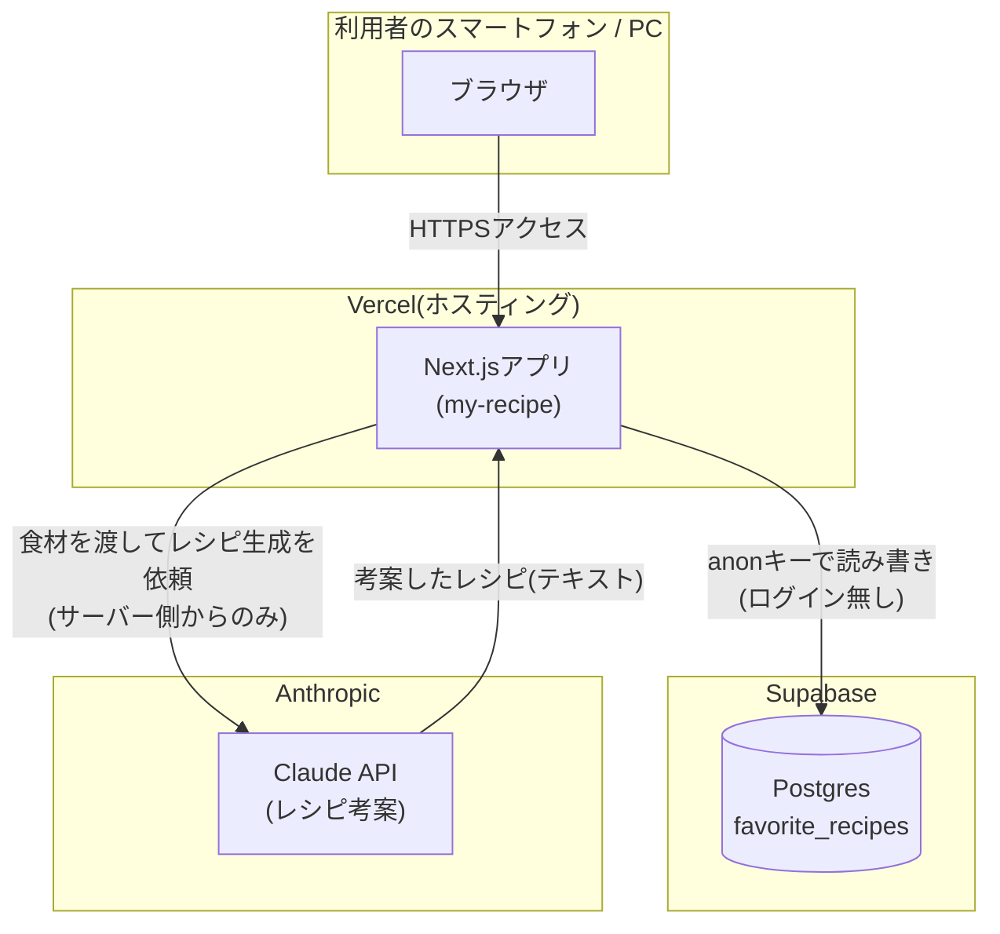
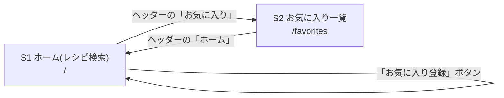
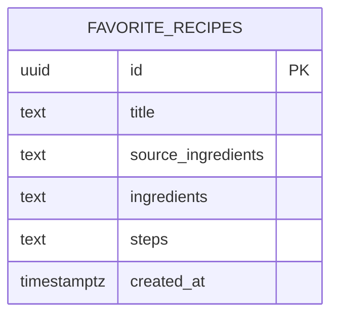

# 基本設計書

要件定義書([01_requirements.md](./01_requirements.md))で定めた要件を、どのような構成で実現するかを定義する。

## 1. システム構成

### 1.1 全体構成図



### 1.2 採用technology stack

| 分類 | 採用技術 | 採用理由 |
|---|---|---|
| フロントエンド/バックエンド | Next.js(App Router) + TypeScript | 画面(フロント)とサーバー処理(バックエンド)を1つのプロジェクトで書けるため、構成をシンプルにできる |
| ホスティング | Vercel | GitHubと連携し、pushするだけで自動デプロイされる。個人利用は無料 |
| データベース | Supabase(PostgreSQL) | お気に入りレシピの保存先。テーブル・行レベルセキュリティを無料で使える |
| レシピ考案AI | Claude API(Anthropic、Claude Haiku 4.5) | 入力された食材から、その場でレシピ(料理名・材料・作り方)を生成するために使用。単純なテキスト生成タスクのため、最も安価なモデルを採用 |

### 1.3 なぜこの構成にしたか

- 個人1人での利用に限定しているため、**認証機能(Supabase Auth)はあえて使わない**。
  ログイン画面・セッション管理を持たないことで、構成をシンプルに保っている(要件定義書 3.3 参照)
- Claude APIのAPIキーは課金対象の秘密情報のため、**ブラウザから直接呼び出さず、
  Next.jsのRoute Handler(サーバー側)経由で呼び出す**構成にしている。ブラウザは
  「食材」を自分のサーバーに送るだけで、Claude APIキーには一切触れない
- レシピ生成はコストが発生する処理のため、**利用者が「レシピを考えてもらう」ボタンを押した時だけ**
  Claude APIを呼び出す設計とする(画面表示や再描画では呼び出さない)
- 生成結果はその場で表示するのみで、利用者が「お気に入り登録」を押した時だけ
  Supabaseに保存する(要件定義書 2.1 のスコープ外事項に対応)

## 2. 画面設計

### 2.1 画面一覧

| # | 画面名 | パス | 概要 |
|---|---|---|---|
| S1 | ホーム(レシピ検索) | `/` | 食材を複数入力してAIにレシピを考案してもらい、結果を表示・お気に入り登録する |
| S2 | お気に入り一覧 | `/favorites` | 保存済みのお気に入りレシピを一覧表示し、削除できる |

ログイン機能を持たないため、上記2画面はすべて誰でもアクセス・操作できる。

### 2.2 画面遷移図



### 2.3 S1(ホーム)の画面構成

1. 食材入力欄(カンマ区切りなどで複数の食材を入力)
2. 「レシピを考えてもらう」ボタン
3. 生成結果表示エリア(料理名・材料・作り方)。未生成時は非表示
4. 生成結果が表示されている間のみ「お気に入り登録」ボタンを表示

### 2.4 S2(お気に入り一覧)の画面構成

- 保存済みのレシピをカード形式で一覧表示(料理名・材料・作り方・登録時に入力していた食材)
- 各カードに「削除」ボタンを表示
- 保存件数が0件の場合は「まだお気に入りがありません」と表示

## 3. データベース設計(概要)

詳細なカラム定義は 03_detailed-design.md(このあと作成)を参照。ここでは全体像のみを示す。



- テーブルは`favorite_recipes`の1つのみ(お気に入り登録された時にだけ1行作られる)
- 他テーブルとのリレーションは無い。`user_id`列も持たない(個人1人での利用に限定しているため)
- `source_ingredients`は「何の食材を入力してこのレシピが生成されたか」を後から見返せるようにするための列

## 4. 外部インターフェース

| 連携先 | 用途 | 認証方法 |
|---|---|---|
| Claude API(Anthropic) | 入力された食材からレシピ(料理名・材料・作り方)を生成する | APIキー(サーバー側の環境変数のみで保持し、Route Handlerからのみ呼び出す) |
| Supabase Database | お気に入りレシピの読み書き(登録・一覧取得・削除) | anonキー(RLSで「誰でも可」に設定) |

## 5. 非機能設計

### 5.1 セキュリティ設計

- Claude APIキーは`NEXT_PUBLIC_`を付けない環境変数(サーバー専用)で管理し、ブラウザには一切公開しない
- お気に入りテーブルへのアクセスはRLSを有効にした上で「anonロールに常に許可」というポリシーで統一する
  (「無効化」ではなく「意図的に開放したポリシー」にすることで、将来ログインを追加する場合に
  ポリシーの条件式を差し替えるだけで済むようにしている)
- 上記の結果、デプロイ後のURLとSupabaseのanonキーを知っていれば誰でもお気に入りを閲覧・削除できる
  ことを許容する(要件定義書 3.3 と同じ制約)

### 5.2 コスト管理設計

- Claude APIの呼び出しは、利用者が「レシピを考えてもらう」ボタンを押した時のみ実行する
  (ページ表示・再描画のたびに自動で呼び出すことはしない)
- 1回の呼び出しで使用するトークン数を抑えるため、プロンプトと期待する返却フォーマットは
  詳細設計書でできるだけ簡潔に定義する
- 利用するモデルは、レシピ考案という単純なテキスト生成タスクであれば十分な性能かつ
  最も安価な**Claude Haiku 4.5**を採用する(高度な推論を要するタスクではないため)

#### 1回あたりのコスト見積もり

Claude Haiku 4.5の料金は **入力 $1.00 / 出力 $5.00(それぞれ100万トークンあたり)** 。
1回のレシピ考案あたりの想定トークン数は次の通り。

| 項目 | 想定トークン数 | 内容 |
|---|---|---|
| 入力 | 約600トークン | システムプロンプト(指示文)+入力食材 |
| 出力 | 約800〜1,000トークン | 料理名・材料・作り方(日本語) |

この想定で計算すると、1回あたりのコストは以下の通り。

```
入力: 600 / 1,000,000 × $1.00 = $0.0006
出力: 1,000 / 1,000,000 × $5.00 = $0.0050
合計: 約 $0.0056(1ドル150円換算で約0.8円)
```

- **1回あたり1円未満**が目安。個人利用で1日10回試しても月額換算で数十円程度と、
  無視できる規模のコストと想定される
- ただし上記はトークン数の見積もりであり、実際の入力プロンプトの長さや生成結果の長さによって変動する。
  正確な金額はAnthropicコンソールの使用量画面で確認できる
- 想定より高額になっていないかの確認方法、Anthropicコンソールでの利用上限(予算アラート)設定の方法は、
  環境構築手順書(このあと作成)に記載する

### 5.3 AI生成結果の扱いに関する設計方針

- AIの生成結果は毎回変わりうるため、「お気に入り登録」しない限りサーバー・データベースのどこにも保存しない
  (要件定義書 2.1 のスコープ外事項に対応)
- Claude APIの呼び出し失敗時、または期待した形式(料理名・材料・作り方)で結果を取得できなかった場合は、
  画面にエラーメッセージを表示し、再試行(ボタンの再押下)を促す
