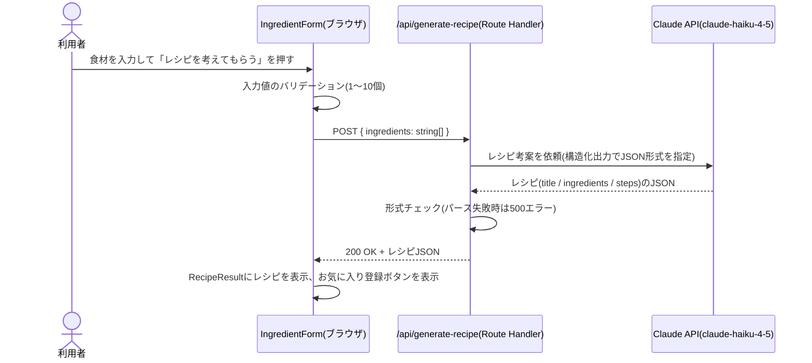

# 詳細設計書

基本設計書([02_basic-design.md](./02_basic-design.md))で定めた構成を、実際にどう実装するかを定義する。
製造(実装)時は、このドキュメントに沿ってコードを作成する。

## 1. ディレクトリ構成

```
my-recipe/
├── app/
│   ├── layout.tsx                     # 全画面共通のレイアウト・フォント設定
│   ├── globals.css                    # 全画面共通のスタイル
│   ├── page.tsx                       # S1: ホーム(レシピ検索)画面
│   ├── favorites/page.tsx             # S2: お気に入り一覧画面
│   ├── actions.ts                     # サーバー処理(Server Actions)。お気に入りの登録・削除
│   └── api/generate-recipe/route.ts   # Route Handler。Claude APIへのレシピ生成依頼(POST)
├── components/
│   ├── Header.tsx                     # 共通ヘッダー(ナビゲーションのみ)
│   ├── IngredientForm.tsx             # 食材入力フォーム+「レシピを考えてもらう」ボタン
│   ├── RecipeResult.tsx               # 生成結果の表示+「お気に入り登録」ボタン
│   ├── FavoriteList.tsx               # お気に入り一覧(FavoriteCardの親)
│   └── FavoriteCard.tsx               # お気に入り1件分のカードUI+削除ボタン
├── lib/
│   ├── types.ts                       # 型定義(Recipe / FavoriteRecipe)
│   ├── claude.ts                      # Claude API呼び出し・プロンプト生成
│   └── supabase/
│       └── server.ts                  # Supabaseクライアント(anonキーのみ)
├── supabase/
│   └── schema.sql                     # テーブル定義・RLSポリシー
├── docs/                              # このドキュメント一式
├── .env.local.example                 # 必要な環境変数の一覧(値は空)
└── README.md                          # セットアップ手順の要約
```

ログイン機能を持たないため、`middleware.ts`・`app/login/`・`lib/supabase/client.ts`(ブラウザ用クライアント)は
作成しない(基本設計書 1.3 参照)。

## 2. 画面ごとの詳細仕様

### 2.1 S1: ホーム画面(`app/page.tsx`)

- **アクセス制御**: なし
- クライアントコンポーネント(`"use client"`)として実装する
  (入力・ボタン操作・生成結果の表示をその場で切り替えるため、サーバーコンポーネントでは実現しづらい)
- **表示内容**: ヘッダー(`Header.tsx`)、食材入力フォーム(`IngredientForm.tsx`)、
  生成結果表示エリア(`RecipeResult.tsx`。未生成時は非表示)
- **状態管理**(`useState`): 入力中の食材文字列、生成中フラグ(ローディング表示用)、
  生成結果(`Recipe | null`)、エラーメッセージ(`string | null`)

#### 2.1.1 食材入力の仕様

- カンマ(`,`)または全角読点(`、`)区切りで複数の食材を1つのテキストボックスに入力する
- 送信前に以下のバリデーションを行う
  - 空文字・空白のみのトークンは除外する
  - トリム後、1つも食材が残らない場合は送信不可(「食材を1つ以上入力してください」を表示)
  - 食材数は**最大10個**までとする(超えた場合は「食材は10個までにしてください」を表示し、
    Claude APIへのリクエストを抑えてコストを一定範囲に保つ)

### 2.2 S2: お気に入り一覧画面(`app/favorites/page.tsx`)

- **アクセス制御**: なし
- サーバーコンポーネントとして実装し、`favorite_recipes` テーブルを`created_at`降順で全件取得して表示する
- `export const dynamic = "force-dynamic"` を指定する
  (kakeiboと同様、認証を使わない構成ではNext.jsが静的ページ化を試みてビルド時エラーになるため)
- 保存件数が0件の場合は「まだお気に入りがありません」と表示する
- 各カード(`FavoriteCard.tsx`)に削除ボタンを表示する

## 3. Claude API呼び出し仕様(`lib/claude.ts`)

### 3.1 呼び出し方針

- 使用モデル: **`claude-haiku-4-5`**(基本設計書 5.2 節の理由により採用)
- 呼び出し元: `app/api/generate-recipe/route.ts`(Route Handler)のみ。ブラウザから直接Claude APIを
  呼び出すことはしない
- APIキーは環境変数 `ANTHROPIC_API_KEY`(`NEXT_PUBLIC_`を付けない)で保持する
- ストリーミングは使用しない(想定出力が1,000トークン程度と短く、タイムアウトの懸念が無いため)
- 拡張思考(thinking)は使用しない(単純なテキスト生成タスクのため不要。コストも抑えられる)

### 3.2 プロンプト設計

- **システムプロンプト**(概要): 「あなたは家庭料理のレシピを考案する料理アシスタントです。
  与えられた食材を活かした、家庭で作りやすい料理のレシピを1つ考案してください。
  塩・こしょう・醤油・油などの基本的な調味料は、リストに無くても使って構いません。
  出力は指定されたJSON形式のみとし、それ以外の説明文は含めないでください。」
- **ユーザーメッセージ**: `次の食材を使ったレシピを考えてください: ${食材をカンマ区切りで連結した文字列}`
- **出力形式**: Anthropic TypeScript SDKの構造化出力機能(`output_config.format`によるJSON Schema指定)を用いて、
  以下の形式のJSONを確実に取得する

```json
{
  "title": "レシピ名(例: 鶏むね肉と白菜の生姜炒め)",
  "ingredients": ["鶏むね肉 200g", "白菜 1/4個", "生姜 1片", "..."],
  "steps": ["鶏むね肉を一口大に切る", "白菜をざく切りにする", "..."]
}
```

- `ingredients`・`steps`はそれぞれ文字列の配列とする(1要素が1材料・1手順に対応)
- 具体的なSDK呼び出しコード(`output_config.format`のスキーマ定義や`max_tokens`の値など)は、
  製造時にAnthropic公式SDKドキュメントの最新仕様を確認した上で実装する

### 3.3 エラー処理

- Claude API呼び出しが失敗した場合(タイムアウト・レート制限・その他エラー)、
  Route Handlerは`500`エラーを返す
- 返却されたJSONが期待した形式(`title`・`ingredients`・`steps`を持つ)でパースできない場合も、
  同様にエラーとして扱う
- いずれの場合も、フロントエンド(`IngredientForm.tsx`)は「レシピの考案に失敗しました。
  もう一度お試しください。」を表示し、再度ボタンを押せば再試行できる状態にする
  (入力した食材は消さずに残す)

### 3.4 レシピ生成の処理シーケンス



## 4. サーバー処理(`app/actions.ts`)仕様

Next.jsの Server Actions(`"use server"`)として実装する。

| 関数 | 呼び出し元 | 処理概要 |
|---|---|---|
| `addFavorite(recipe, sourceIngredients)` | `RecipeResult.tsx`(お気に入り登録ボタン) | `favorite_recipes` テーブルに1件INSERT |
| `deleteFavorite(id)` | `FavoriteCard.tsx`(削除ボタン) | 該当行をDELETE |

- `addFavorite`は、生成された`Recipe`(`title` / `ingredients` / `steps`)と、
  検索時に入力していた食材の文字列(`sourceIngredients`)を受け取り、`favorite_recipes`に1行追加する
- `ingredients`・`steps`(いずれも配列)は、DBには**改行区切りの1つのテキスト**として保存する
  (jsonb型を使わず、kakeiboと同様シンプルなtext型で統一する。表示側で改行ごとに分割してリスト表示する)
- ログイン機能が無いため、これらの関数はいずれも「誰が呼んだか」を確認しない。アクセス制御は
  データベース側のRLSポリシー(5.3参照)に委ねている
- `deleteFavorite`実行後は`revalidatePath("/favorites")`で一覧を再描画する

## 5. データベース詳細設計(`supabase/schema.sql`)

### 5.1 `favorite_recipes` テーブル

| カラム名 | 型 | NULL | デフォルト | 説明 |
|---|---|---|---|---|
| `id` | `uuid` | NOT NULL | `gen_random_uuid()` | 主キー |
| `title` | `text` | NOT NULL | - | レシピ名 |
| `source_ingredients` | `text` | NOT NULL | - | 検索時に入力した食材(カンマ区切りの文字列) |
| `ingredients` | `text` | NOT NULL | - | 材料(1行1材料、改行区切り) |
| `steps` | `text` | NOT NULL | - | 作り方(1行1手順、改行区切り) |
| `created_at` | `timestamptz` | NOT NULL | `now()` | 登録日時 |

インデックス: `favorite_recipes_created_idx`(`created_at` 降順。一覧表示の並び替え用)

他テーブルとのリレーションは無い。`user_id`列も持たない(個人1人での利用に限定しているため)。

### 5.2 行レベルセキュリティ(RLS)ポリシー一覧

| テーブル | ポリシー名 | 対象操作 | 条件 |
|---|---|---|---|
| `favorite_recipes` | anyone can view favorites | SELECT | 常に許可(`true`) |
| `favorite_recipes` | anyone can add favorites | INSERT | 常に許可(`true`) |
| `favorite_recipes` | anyone can delete favorites | DELETE | 常に許可(`true`) |

UPDATEのポリシーは作成しない(お気に入りの編集機能を持たないため)。
いずれも「anonロールを含む誰でも許可」という、意図的に開放したポリシーになっている
(要件定義書 3.3・基本設計書 5.1 のとおり、ログイン機能を持たないための設計判断)。

## 6. Supabaseクライアント(`lib/supabase/server.ts`)

- kakeiboの`lib/supabase/server.ts`と同様、`@supabase/supabase-js`の素のクライアントを
  `NEXT_PUBLIC_SUPABASE_URL` / `NEXT_PUBLIC_SUPABASE_ANON_KEY` で生成する
- cookieの読み書きやセッション管理は行わない(認証機能を使わないため不要)
- サーバーコンポーネント(`app/favorites/page.tsx`)・Server Actions(`app/actions.ts`)の両方から
  同じ関数を呼び出す

## 7. 環境変数一覧(`.env.local.example`)

| 変数名 | ブラウザに公開されるか | 用途 |
|---|---|---|
| `NEXT_PUBLIC_SUPABASE_URL` | 公開される | SupabaseプロジェクトのURL |
| `NEXT_PUBLIC_SUPABASE_ANON_KEY` | 公開される | Supabaseのanonキー |
| `ANTHROPIC_API_KEY` | **公開されない**(サーバー専用) | Claude API呼び出し用のAPIキー |

`ANTHROPIC_API_KEY`に`NEXT_PUBLIC_`を付けてしまうと課金対象の秘密情報がブラウザに漏洩するため、
命名を誤らないよう特に注意する。

## 8. 既知の制約・注意点

- **ログイン機能が無い**ため、URLとSupabaseのanonキーを知っている人は誰でもお気に入りを読み書きできる。
  個人利用の範囲を超えて公開する場合は、Vercelの「Deployment Protection」等で別途アクセス制限を行うこと
- **生成結果の再現性は無い**。同じ食材で再度「レシピを考えてもらう」を押しても、AIが返す内容は
  毎回変わりうる(要件定義書 2.1 のスコープ外事項のとおり、この挙動は仕様として許容する)
- **お気に入りの編集機能は無い**(登録・削除のみ)。内容を直したい場合は、現状はSupabaseの
  「Table Editor」から直接編集する必要がある
