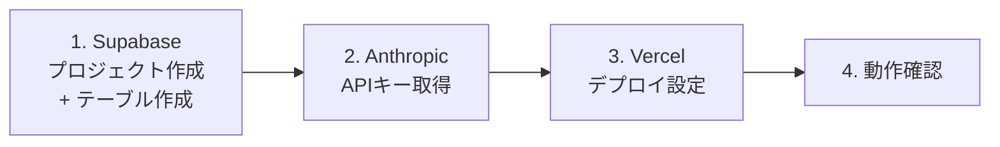

# 環境構築手順書

このアプリを新しい環境(新しいSupabase/Vercel/Anthropicアカウントなど)にゼロから構築するための手順書。

## 0. 全体の流れ

kakeiboと異なり、レシピ考案のために**Anthropic(Claude API)のAPIキーが追加で必要**になる
(唯一の課金対象。詳細は5節参照)。

## 1. Supabaseのセットアップ

### 1.1 プロジェクト作成

1. https://supabase.com を開き、GitHubアカウントでログイン
2. 「New Project」から新規プロジェクトを作成(プロジェクト名は任意、リージョンは `Northeast Asia (Tokyo)` 推奨)

### 1.2 テーブルの作成

1. 左メニューの **「SQL Editor」** を開く
2. 「New query」を選び、[`../supabase/schema.sql`](../supabase/schema.sql) の中身をすべてコピーして貼り付け、**Run**
   (`favorite_recipes`テーブルとRLSポリシーがまとめて作成される)
3. 左メニューの **「Table Editor」** を開き、`favorite_recipes`(0件)のテーブルができていることを確認

### 1.3 APIキーの取得

1. 左メニューの **「Project Settings」**(歯車アイコン)→ **「API」** または **「API Keys」**
2. 以下の値をメモしておく(あとでVercelに登録する)
   - **Project URL**
   - **Publishable key**(`sb_publishable_...` から始まるもの。旧称: anon / public key)

`service role key`(管理者鍵)は本アプリでは使用しない。

## 2. Anthropic(Claude API)のセットアップ

### 2.1 APIキーの取得

1. https://console.anthropic.com を開き、アカウントを作成(または既存アカウントでログイン)
2. 支払い方法(クレジットカード)を登録する(**「Billing」**メニュー)。従量課金のため、
   利用しなければ課金は発生しない
3. 左メニューの **「API Keys」** から「Create Key」を選び、APIキー(`sk-ant-...`)を作成する
   - 作成直後しか全文が表示されないため、必ずこの時点でコピーしてメモしておく

### 2.2 利用上限(予算アラート)の設定(推奨)

想定外の高額請求を防ぐため、以下の設定を行っておくことを推奨する。

1. 「Billing」→「Usage limits」(または類似の設定項目)を開く
2. 月間の利用上限額(例: $5)を設定する。上限に近づくとメール通知が届く

### 2.3 コストの目安

基本設計書 5.2 節のとおり、採用モデル(`claude-haiku-4-5`)でのレシピ考案1回あたりのコストは
**1円未満**が目安。個人利用であれば月額でも数十円〜数百円程度に収まると想定される。
実際の利用量・金額は、Anthropicコンソールの **「Usage」** 画面でいつでも確認できる。

## 3. Vercelのセットアップ

### 3.1 プロジェクトのインポート

1. https://vercel.com を開き、GitHubアカウントでログイン
2. 「Add New...」→「Project」
3. 対象のGitHubリポジトリ(このアプリが入っているリポジトリ)を選択し「Import」

### 3.2 Root Directoryの設定

このアプリは、リポジトリのルートではなく `my-recipe` フォルダの中にある。そのため、
「Configure Project」画面(初回インポート時)または「Settings → General」(インポート後)の
**「Root Directory」** を、**`my-recipe`** に設定すること。

### 3.3 環境変数の登録

「Environment Variables」に、以下の3つを登録する(Key / Valueの組で1行ずつ追加。
Environmentは Production / Preview / Development すべてにチェック)。

| Key | Value | 取得元 |
|---|---|---|
| `NEXT_PUBLIC_SUPABASE_URL` | SupabaseのProject URL | 手順1.3 |
| `NEXT_PUBLIC_SUPABASE_ANON_KEY` | Supabaseの Publishable key | 手順1.3 |
| `ANTHROPIC_API_KEY` | AnthropicのAPIキー(`sk-ant-...`) | 手順2.1 |

**`ANTHROPIC_API_KEY`に`NEXT_PUBLIC_`を付けないこと**(付けるとブラウザに公開され、
第三者に無断でAPIを使われて課金される危険がある)。

登録後、「Deploy」をタップする。

## 4. 動作確認

1. VercelのURLをブラウザで開く(ログイン画面は無いので、開けばそのままホーム画面が表示される)
2. 食材入力欄に「鶏むね肉, 白菜」のように複数の食材を入力し、「レシピを考えてもらう」を押す
3. 数秒後、料理名・材料・作り方が表示されることを確認する
4. 「お気に入り登録」ボタンを押し、成功のメッセージが表示されることを確認する
5. ヘッダーの「お気に入り」から `/favorites` を開き、今登録したレシピが一覧に表示されることを確認する
6. 「削除」ボタンを押し、一覧から消えることを確認する

## 5. トラブルシューティング

### 5.1 ビルドが `supabaseUrl is required` で失敗する

Vercelに環境変数(3.3)が登録されていない、またはRoot Directoryの設定(3.2)が誤っている可能性が高い。
「Settings → Environment Variables」と「Settings → General → Root Directory」を確認し、
修正後は「Deployments」タブから最新のデプロイを「Redeploy」する。

### 5.2 「レシピの考案に失敗しました」と表示される

1. Vercelの環境変数に `ANTHROPIC_API_KEY` が登録されているか確認する(3.3)
2. Anthropicコンソールの「Billing」で、支払い方法が登録されているか確認する(2.1)。
   未登録の場合はAPI呼び出しがエラーになる
3. Vercelの「Deployments」→対象デプロイ→「Functions」のログで、実際のエラー内容を確認する

### 5.3 お気に入り一覧にデータが表示されない

1. Supabaseで `supabase/schema.sql` を実行済みか確認する(1.2)
2. Supabaseの左メニュー「Table Editor」で、`favorite_recipes`にデータが入っているか確認する
3. Vercelに登録した環境変数のURL・キーが、実際のSupabaseプロジェクトのものと一致しているか確認する

## 6. 料金について(参考)

| サービス | 無料枠の目安 | 注意点 |
|---|---|---|
| Vercel(Hobby) | 月100GB通信・100万アクセスまで無料 | 個人・非商用利用限定 |
| Supabase(Free) | DB 500MB、月間アクティブユーザー50,000人まで無料 | 1週間アクセスが無いと自動一時停止(データは消えない、手動再開可) |
| Anthropic(Claude API) | 無料枠なし(従量課金) | 1回のレシピ考案あたり1円未満が目安(2節参照)。利用上限の設定を推奨 |
